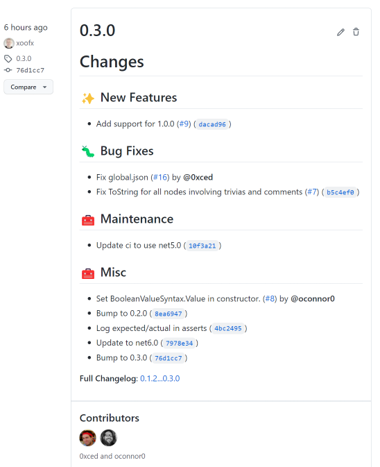

# Changelog User Guide

`dotnet-releaser` allows to generate changelogs that will be pushed as release notes. It **supports 2 modes**:

- **Automatic**

  This is the default mode that will generate automatically pretty changelogs directly from your pull-requests and commit changes, fully customized with categories, auto-labelers, contributors/labels filtering and templates. If you are familiar with solutions like [Release Drafter](https://github.com/release-drafter/release-drafter), `dotnet-releaser` provides similar integrated features and goes beyond.

- **Manual**

  This mode is more interesting if you are writing your changelog manually in a file and want to transfer this automatically to your release notes.

Table of Content

- [1. Automatic changelogs](#1-automatic-changelogs)
  - [1.1 Overview](#11-overview)
  - [1.2 Properties](#12-properties)
  - [1.3 Categories](#13-categories)
  - [1.4 Auto-labelers](#14-auto-labelers)
  - [1.3 Templates](#13-templates)
    - [1.3.1 Commit template](#131-commit-template)
    - [1.3.2 Pull-Request template](#132-pull-request-template)
    - [1.3.3 Body template](#133-body-template)
    - [1.3.4 Extra template properties](#134-extra-template-properties)
- [2. Manual changelogs](#2-manual-changelogs)
- [3. Disabling changelogs](#3-disabling-changelogs)
  

## 1. Automatic changelogs

### 1.1 Overview

By default, this feature is enabled and you don't have to configure anything to get the benefit of it. Though, the automatic changelogs is highly customizable with many configuration knobs, from defining auto-labelers or the [Scriban](https://github.com/scriban/scriban) templates used to generate the changelog. The following sections are describing all the possibilities of configuration. 

The image below is an example of an auto-generated changelog from pull-requests and commits on the project [Tomlyn](https://github.com/xoofx/Tomlyn/releases).



### 1.2 Properties

| `[changelog]`                         | Type       | Description                |
|---------------------------------------|------------|----------------------------|
| `publish`                             | `bool`     | Enable changelog publish. Default is `true`.
| `name_template`                       | `string`   | A template for the title of the release. The default is `{{ version.tag }}`.
| `owners_commit_change_template`       | `string`   | A template for each commit made by the owners of the repository. The default is `- {{ commit.title }} ({{ commit.sha}})`.
| `owners_pull_request_change_template` | `string`   | A template for each pull-request made by the owners of the repository. The default is `- {{ pr.title }} (PR #{{ pr.number }})`.
| `commit_change_template`              | `string`   | A template for each commit made by contributors of the repository. The default is `- {{ commit.title }} ({{ commit.sha}}) by @{{ commit.author }}`. The difference with `owners_commit_change_template` is that it includes the mention of the contributor.
| `pull_request_change_template`        | `string`   | A template for each pull-request made by contributors of the repository. The default is `- {{ pr.title }} (PR #{{ pr.number }}) by @{{ pr.author }}`. The difference with `owners_pull_request_change_template` is that it includes the mention of the contributor.
| `include_commits`                     | `bool`     | Defines whether to include commits - not present in pull-requests - in the changelog. Default is `true`.
| `defaults`                            | `bool`     | Defines whether to add all pre-configured default categories and auto-labelers. Default is `true`. See configuration following sections.
| `owners`                              | `string[]` | The list of owners to consider in the changelog. By default, the owner defined in the `[github]` section is added automatically if `defaults = true`.
| `include.labels`                      | `string[]` | The list of labels that are _required_ to be present on a pull-request to be listed in the changelog. By default this list is empty.
| `include.contributors`                | `string[]` | The list of contributors that are _required_ for the author of a pull-request to be listed in the changelog. By default this list is empty.
| `exclude.labels`                      | `string[]` | The list of labels that if present on a pull-request will exclude the pull-request from being listed in the changelog. By default and if `defaults = true`, this list contains `skip-release-notes`.
| `exclude.contributors`                | `string[]` | The list of contributors that if present on a pull-request will exclude the pull-request from being listed in the changelog.
| `body_template`                       | `string`   | A template of the body of the release notes. The default is defined below.
| `template_properties`                 | `map<string, object>`  | Allow to define user properties that are made accessible in all templates through the `properties` variable. See usage in following sections.
| `[[changelog.autolabeler]]`           | `autolabeler` | The list of autolabelers configured. This is described in more details in the following sections.
| `[[changelog.category]]`              | `category`    | The list of categories configured. This is described in more details in the following sections.

The default of the `body_template` is the following [Scriban](https://github.com/scriban/scriban) template with `markdown`:

```md
# Changes

{{ changes }}

**Full Changelog**: {{ url_full_changelog_compare_changes }}
```
### 1.3 Categories

Categories allow to define how the changes are organized within your release notes.

| `[[changelog.category]]`              | Type       | Description                |
|---------------------------------------|------------|----------------------------|
| `title`                               | `string`   | Defines the markdown title that will be used for this category in the release notes.
| `labels`                              | `string[]` | A list of pull-request labels that are associated with this category. Each pull-request that will have this label defined in this list will belong to this category.
| `exclude.labels`                      | `string[]` | A list of pull-request labels that, if defined on a pull-request will exclude the pull-request to be part of this category.
| `exclude.contributors`                | `string[]` | A list of pull-request contributors that, if are the authors in the pull-request will exclude the PR to be part of this category.
| `order`                               | `int`      | An integer that defines the order of the category when it will be displayed in the release notes. The lower the value is, the higher in the list in the release notes the category will be displayed. If this value is not defined, it is assumed to be 0.

> NOTE: The order of the category definitions as they appear in the configuration file will be used to match-first a category and will stop the search for matching categories. The following defaults are added after the user defined categories. This allows, for example, to easily override an existing category if necessary while keeping defaults enabled.

By default, and if `defaults` is kept to `true`, the following list of categories will used as defaults:

```toml
[[changelog.category]]
title = "## 🚨 Breaking Changes"
labels = ["breaking-change", "category: breaking-change"]
order = 10

[[changelog.category]]
title = "## ✨ New Features"
labels = ["new-feature", "feature", "category: feature"]
order = 20

[[changelog.category]]
title = "## 🐛 Bug Fixes"
labels = ["bugfix", "fix", "bug", "category: bug"]
order = 30

[[changelog.category]]
title = "## 🚀 Enhancements"
labels = ["enhancement", "refactor", "performance", "category: performance", "category: enhancement"]
order = 40

[[changelog.category]]
title = "## 🧰 Maintenance"
labels = ["maintenance", "ci", "category: ci"]
order = 50

[[changelog.category]]
title = "## 🏭 Tests"
labels = ["tests", "test", "category: tests"]
order = 60

[[changelog.category]]
title = "## 🛠 Examples"
labels = ["examples", "samples", "category: samples", "category: examples"]
order = 70

[[changelog.category]]
title = "## 📚 Documentation"
labels = ["documentation", "doc", "category: documentation", "category: doc"]
order = 80

[[changelog.category]]
title = "## 🌎 Accessibility"
labels = ["translations", "accessibility", "category: accessibility"]
order = 90

[[changelog.category]]
title = "## 📦 Dependencies"
labels = ["dependencies", "deps", "category: dependencies"]
order = 100

[[changelog.category]]
title = "## 🧰 Misc"
labels = ["misc", "category: misc"]
order = 110
```

### 1.4 Auto-labelers

By default, It is very convenient that if you don't setup labels on your pull-requests, or you have also commits not made through a pull-request that are going to be included in your release notes, to have a way to automatically assign a label based on a regex of different properties (PR/commit title, body, branch, files) coming from a change (commit or pull-request).

Auto-labelers allow to define such pattern matching to automatically route commits and pull-requests to a category/label.

| `[[changelog.autolabeler]]`             | Type       | Description                |
|-----------------------------------------|------------|----------------------------|
| `label`                                 | `string`   | The label that will be assigned if one of the following match is `true`.
| `title`                                 | `string[]` | A list of regex that will match the title of the pull-request or commit.
| `body`                                  | `string[]` | A list of regex that will match the message body of the pull-request or commit.
| `branch`                                | `string[]` | A list of regex that will match the branch name of the pull-request.
| `files`                                 | `string[]` | A list of file globs that will match the files of a pull-request. For example `/doc/*.md` or `**/*.cs`

> NOTE: As for categories, the order of definition is important for auto-labelers as they appear defined in the configuration file. The defaults auto-labelers listed below are added after the user-defined, so they can be easily override.

By default, and if `changelog.defaults` is kept to `true`, the list of the default autolabelers is defined below:

```toml
[[changelog.autolabeler]]
label = "breaking-change"
title = '^[Bb]reaking\s+[Cc]hange'

# Matches any title starting by e.g `Add/Improve/Fix/Update ci`
# and attach to the PR/Commit the `maintenance` label
[[changelog.autolabeler]]
label = "maintenance"
title = '^(([Aa]dd)|([Ii]mprove)|([Ff]ix)|([Uu]pdate))\s+ci\b'

# Matches any title starting by e.g `Add/Improve/Fix/Update doc`
# and attach to the PR/Commit the `documentation` label
[[changelog.autolabeler]]
label = "documentation"
title = '^(([Aa]dd)|([Ii]mprove)|([Ff]ix)|([Uu]pdate))\s+[Dd]oc'

# Matches any title starting by e.g `Add/Improve/Fix/Update test`
# and attach to the PR/Commit the `tests` label
[[changelog.autolabeler]]
label = "tests"
title = '^(([Aa]dd)|([Ii]mprove)|([Ff]ix)|([Uu]pdate))\s+[Tt]est'

# Matches any title starting by e.g `Add/Improve/Fix/Update example`
# and attach to the PR/Commit the `examples` label
[[changelog.autolabeler]]
label = "examples"
title = '^(([Aa]dd)|([Ii]mprove)|([Ff]ix)|([Uu]pdate))\s+[Ee]xample'

# Matches any title starting by e.g `Add/Improve/Fix/Update accessibility`
# and attach to the PR/Commit the `accessibility` label
[[changelog.autolabeler]]
label = "accessibility"
title = [
  '^(([Aa]dd)|([Ii]mprove)|([Ff]ix)|([Uu]pdate))\s+[Aa]ccessibility',
  '^(([Aa]dd)|([Ii]mprove)|([Ff]ix)|([Uu]pdate))\s+[Tt]ranslation',
]

# Matches any title starting by e.g `Fix/Bugfix`
# and attach to the PR/Commit the `bugfix` label
[[changelog.autolabeler]]
label = "bugfix"
title = '^(([Ff]ix)|([Bb]ugfix))'

# Matches any title starting by e.g `Add`
# and attach to the PR/Commit the `feature` label
[[changelog.autolabeler]]
label = "feature"
title = '^([Aa]dd)\s+'

# Matches any title starting by e.g `Enhance`
# and attach to the PR/Commit the `enhancement` label
[[changelog.autolabeler]]
label = "enhancement"
title = [
  '^(([Ee]nhance)|([Rr]efactor))',
  '^([Ii]mprove)\s+[Pp]erf'
]

# Matches any title starting by e.g `Add`
# and attach to the PR/Commit the `dependencies` label
[[changelog.autolabeler]]
label = "dependencies"
title = [
  '^([Uu]pdate)\s+[Dd]epend',
  '^([Bb]ump)\s+\w{3,}' # Don't match e.g `Bump to`
]

# Matches anything left that hasn't been matched by previous auto-labelers
# and attach to the PR/Commit the `misc` label
[[changelog.autolabeler]]
label = "misc"
title = '.' # Matches any characters
```

### 1.3 Templates

The following section defines the variables and objects accessible for each [Scriban](https://github.com/scriban/scriban) template. The text format for GitHub release notes is markdown, so the templates are in-fine emitting markdown text.

#### 1.3.1 Commit template

This is relevant for both templates `owners_commit_change_template` and `commit_change_template`:

| Variable             | Type       | Description                |
|----------------------|------------|----------------------------|
| `commit`             | `commit`   | The commit object defined below.
| `properties`         | `properties` | [User defined extra properties](#134-extra-template-properties) from configuration.


The `commit` object contains the following properties:

| `commit`             | Type       | Description                |
|----------------------|------------|----------------------------|
| `commit.title`       | `string`   | The title of the commit.
| `commit.body`        | `string`   | The message body of commit.
| `commit.author`      | `string`   | The GitHub author login of the commit.
| `commit.sha`         | `string`   | The first 8 characters of the sha of the commit.
| `commit.full_sha`    | `string`   | The full sha.


For example, the default template for `commit_change_template` is:

```toml
[changelog]
commit_change_template = "- {{ commit.title }} ({{ commit.sha}}) by @{{ commit.author }}"
```
#### 1.3.2 Pull-Request template

This is relevant for both templates `owners_pull_request_change_template` and `pull_request_change_template`:

| Variable             | Type       | Description                |
|----------------------|------------|----------------------------|
| `pr`                 | `pr`       | The pull-request object defined below.
| `properties`         | `properties` | [User defined extra properties](#134-extra-template-properties) from configuration.


The `pr` object contains the following properties:

| `pr`             | Type       | Description                |
|------------------|------------|----------------------------|
| `pr.number`      | `int`      | The pull request number (e.g `#3`).
| `pr.branch`      | `string`   | The repository/branch the pull request originates from (e.g `xoofx:this_is_a_branch`).
| `pr.title`       | `string`   | The title of the pull-request.
| `pr.body`        | `string`   | The message body of pull-request.
| `pr.author`      | `string`   | The GitHub author login of the pull-request.
| `pr.labels`      | `string[]` | The labels attaches to the pull-request.
| `pr.files`       | `string[]` | The files modified by the pull-request.

For example, the default template for `pull_request_change_template` is:

```toml
[changelog]
pull_request_change_template = "- {{ pr.title }} (PR #{{ pr.number }}) by @{{ pr.author }}"
```

#### 1.3.3 Body template

This is relevant for `body_template`:

| Variable             | Type       | Description                |
|----------------------|------------|----------------------------|
| `changes`            | `string`   | The markdown text generated from the categories and the commit/PR templates.
| `version`            | `version`  | The version object for the current version of the release.
| `previous_version`   | `version`  | The version object for the previous version relative to the current release.
| `url_full_changelog_compare_changes`   | `string`  | The URL to the full compare changelog between the previous and current version.
| `properties`         | `properties` | [User defined extra properties](#134-extra-template-properties) from configuration.

For example, the default body template is:

```toml
[changelog]
body_template = '''
# Changes

{{ changes }}

**Full Changelog**: {{ url_full_changelog_compare_changes }}
'''
```

#### 1.3.4 Extra template properties

You can define extra properties via `[changelog.template_properties]` that will be accessible from any of the templates listed above.

```toml
[changelog.template_properties]
changes_pre_title = "Amazing"
hello_number = 1
```

You can then reuse these properties from any templates. For example, using them from the `body_template`:


```toml
[changelog]
body_template = '''
# {{ properties.changes_pre_title }} Changes {{ properties.hello_number }}

{{ changes }}

**Full Changelog**: {{ url_full_changelog_compare_changes }}
'''
```

## 2. Manual changelogs

`dotnet-releaser` can help to transfer your manually written changelog (e.g from a `changelog.md`) to your GitHub release for a specific version of the package published.

| `[changelog]`    | Type       | Description                |
|------------------|------------|----------------------------|
| `publish`        | `bool`     | Enable to disable changelog publish. Default is `true`.
| `path`           | `string`   | Path to a changelog file. The path can be relative to the configuration file.
| `version`        | `string`   | A regular expression used to identify the changelogs for a specific version. The default regex `^#+\s+v?((\d+\.)*(\d+))` will match any classic markdown headers that contain a version number, optionally pre-fixed by `v`.

For example, if your changelog is written like this in one folder above the configuration file:

```md

# Changelog

## 1.3.1 (27 Oct 2021)

### Fixes
- Fix for this annoying bug...

### Breaking changes
- ...
```

And your configuration for the changelog can be described like this:

```toml
[changelog]
path = "../changelog.md" # Setting the path to a manual changelog.
```
If you are publishing the `1.3.1` version of your package, it will extract the markdown after the `## 1.3.1` header:

```md
### Fixes
- Fix for this annoying bug...

### Breaking changes
- ...
```

And this will be uploaded to your tag release.


## 3. Disabling changelogs

**Changelog is enabled by default** but can be disabled entirely by setting `publish = false`:

```toml
[changelog]
publish = false
```