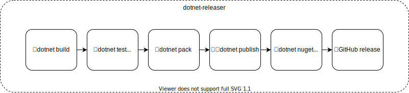
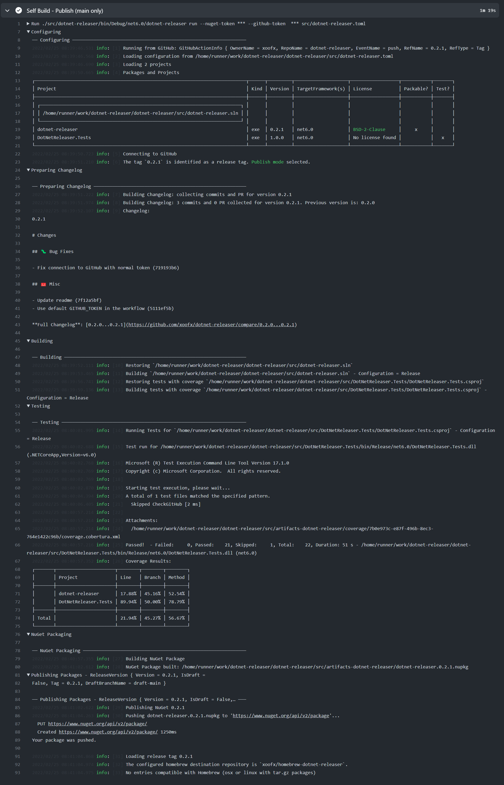

# `dotnet-releaser` User Guide

- [1. Overview](#1-overview)
  - [1.1. Getting started](#11-getting-started)
    - [1.1.1. Install dotnet-releaser](#111-install-dotnet-releaser)
    - [1.1.2. Create a TOM configuration file](#112-create-a-tom-configuration-file)
    - [1.1.3. Build](#113-build)
    - [1.1.4. Publish](#114-publish)
  - [1.2. Adding dotnet-releaser to your CI on GitHub](#12-adding-dotnet-releaser-to-your-ci-on-github)
    - [1.2.1. Steps for a GitHub CI Integration](#121-steps-for-a-github-ci-integration)
    - [1.2.2. Example of a GitHub CI Integration](#122-example-of-a-github-ci-integration)
  - [1.3. Prepare your project/packages](#13-prepare-your-projectpackages)
    - [1.3.1. Setup correctly your project for packaging](#131-setup-correctly-your-project-for-packaging)
    - [1.3.2. Disable packaging for projects non package-able](#132-disable-packaging-for-projects-non-package-able)
    - [1.3.3. Versioning of your package](#133-versioning-of-your-package)
- [2. Configuration](#2-configuration)
  - [2.1. General](#21-general)
  - [2.2. MSBuild](#22-msbuild)
  - [2.3. Tests](#23-tests)
  - [2.4. Coverage](#24-coverage)
  - [2.5. Coveralls](#25-coveralls)
  - [2.6. GitHub](#26-github)
  - [2.7. Packaging](#27-packaging)
  - [2.8. NuGet](#28-nuget)
  - [2.9. Homebrew](#29-homebrew)
  - [2.10. Changelog](#210-changelog)
  - [2.11. Service](#211-service)
    - [2.11.1. Systemd](#2111-systemd)
  - [2.12. Package Dependencies](#212-package-dependencies)
- [3. CLI Usage](#3-cli-usage)
  - [3.1. `dotnet-releaser new`](#31-dotnet-releaser-new)
  - [3.2. `dotnet-releaser build`](#32-dotnet-releaser-build)
  - [3.3. `dotnet-releaser publish`](#33-dotnet-releaser-publish)
  - [3.4. `dotnet-releaser run`](#34-dotnet-releaser-run)
  - [3.5. `dotnet-releaser changelog`](#35-dotnet-releaser-changelog)
  - [3.6. Logs generated by `dotnet-releaser`](#36-logs-generated-by-dotnet-releaser)

## 1. Overview

`dotnet-releaser` allows to easily automate the build of your .NET libraries and applications by wrapping:

- `dotnet build` with potentially multiple solutions
- `dotnet test`
  - Plus the automatic support for coverage.
- `dotnet pack` for creating NuGet packages
- `dotnet publish` that can automatically cross-compile to 9+ CPU/OS platforms.
  - And create additionally, by default, multiple packages (zip, debian, rpm...) to distribute your app
- `dotnet nuget push` to publish your package to a NuGet registry
- Pretty changelog creation from pull-requests and commits.
- Create and upload the changelog and all the packages packed to your GitHub repository associated with the release tag.
- It will publish automatically the coverage results to https://coveralls.io if your repository is created there.



### 1.1. Getting started


#### 1.1.1. Install dotnet-releaser

`dotnet-releaser` expects that [.NET 6 SDK](https://dotnet.microsoft.com/en-us/download/dotnet/6.0) is installed.

Then you just need to install it as a global tool. Update to the latest version if you have installed it already!

```shell
dotnet tool install --global dotnet-releaser
```
#### 1.1.2. Create a TOM configuration file

You need to create a TOML configuration file that will instruct which project to build and package, and to which GitHub repository.

You can use `dotnet-releaser new` to create this configuration file.

Let's create a .NET HelloWorld project:

```shell
dotnet new console --name HelloWorld
```

```shell
cd HelloWorld
dotnet-releaser new --project HelloWorld.csproj
```

This will create a `dotnet-releaser.toml`. Replace the GitHub user/repository associated with the tool. You only need to specify them if you are going to publish to GitHub.

```toml
# configuration file for dotnet-releaser
[msbuild]
project = "HelloWorld.csproj"  # You can put directly a solution file here, or also multiple projects or solution files.
[github]
user = "github_user_or_org_here"
repo = "github_repo_here"
```

> In practice, you don't need to configure more than these defaults. 

#### 1.1.3. Build

You can cross-compile and build all packages by running the sub-command `build`:

```shell
dotnet-releaser build --force dotnet-releaser.toml
```

It will create a sub folder `artifacts-dotnet-releaser` (Don't forget to add it to your `.gitignore`!) that will contain:

```shell
> ls artifacts-dotnet-releaser
HelloWorld.1.0.0.linux-arm.deb        
HelloWorld.1.0.0.linux-arm.tar.gz     
HelloWorld.1.0.0.linux-arm64.deb      
HelloWorld.1.0.0.linux-arm64.tar.gz   
HelloWorld.1.0.0.linux-x64.deb        
HelloWorld.1.0.0.linux-x64.tar.gz     
HelloWorld.1.0.0.nupkg                
HelloWorld.1.0.0.osx-arm64.tar.gz     
HelloWorld.1.0.0.osx-x64.tar.gz       
HelloWorld.1.0.0.rhel-x64.rpm         
HelloWorld.1.0.0.rhel-x64.tar.gz      
HelloWorld.1.0.0.win-arm.zip          
HelloWorld.1.0.0.win-arm64.zip        
HelloWorld.1.0.0.win-x64.zip          
```
#### 1.1.4. Publish

The `publish` command allows to build and publish all packages to GitHub and NuGet.

```shell
dotnet-releaser publish --force --github-token "${{secrets.GITHUB_TOKEN}}" --nuget-token "${{secrets.YOUR_NUGET_SECRET_TOKEN}}"  dotnet-releaser.toml
```

> NOTE: When running from a GitHub Action, it is recommended to use the predefined `GITHUB_TOKEN` accessible from your secrets: `${{secrets.GITHUB_TOKEN}}`.
>
> It is recommended to use `dotnet-releaser run` instead when running from a GitHub Action, as explained in the following section.

If you want to run this from a command line, you need to a [personal access token](https://docs.github.com/en/authentication/keeping-your-account-and-data-secure/creating-a-personal-access-token)

You should tick the `public_repo` in the list:

- [x] public_repo

And put an appropriate expiration date.


### 1.2. Adding dotnet-releaser to your CI on GitHub

You can easily replace all the steps used to build, tests, cover, pack and publish your library or application with `dotnet-releaser`, as it will automate entirely the publication of your package.

#### 1.2.1. Steps for a GitHub CI Integration

In order to use `dotnet-releaser` on your GitHub CI, you need:

1. Checkout your repository with the correct settings with [actions/checkout](https://github.com/actions/checkout) 
   - Verify that you are using `v2` and by setting the property `fetch-depth: 0` to get all previous tags. See example below.
2. To install `dotnet 6.0`
3. To install the global tool `dotnet-releaser`
  ```sh
  dotnet tool install --global dotnet-releaser
  ```
4. To run the dotnet-releaser command assuming that you have added all the secret tokens to your GitHub repository
  ```sh
  dotnet-releaser run --nuget-token "${{secrets.NUGET_TOKEN}}" --github-token "${{secrets.GITHUB_TOKEN}}" src/dotnet-releaser.toml
  ```
  It is recommended to use `shell: bash` on GitHub Action so that if a secrets token is empty, bash won't remove the quotes, [unlike pwsh](https://github.com/PowerShell/PowerShell/issues/1995).

Depending on the kind of GitHub event, the run command will automatically:

- If it is a pull-request or a push to a non release branch, it will **perform a full build**. 
- If it is a `push` to a branch and the branch is a release branch (configured in `github.branches`), then it will **perform a full build** and it will **upload a release draft with changelog** with the name of the branch prefixed by `draft-{name_of_the_branch}` (example: `draft-main`). You can disable the create of a draft release but it is usually convenient to look at what will be your next release notes.
- If it is a `push` with a tag version (e.g `v1.9.6` as configured with `[github]` section in the configuration) it will **perform a full build with publish**
  - For an application, it will publish multiple cross-compiled packages to your release

#### 1.2.2. Example of a GitHub CI Integration

An example of a setup with GitHub Actions:

```yaml
    steps:
    - name: Checkout
      uses: actions/checkout@v2
      with:
        fetch-depth: 0

    - name: Install .NET 6.0
      uses: actions/setup-dotnet@v1
      with:
        dotnet-version: '6.0.x'

    - name: Build, Tests, Cover, Pack and Publish (on push tag)
      shell: bash
      run: |
        dotnet tool install --global dotnet-releaser
        dotnet-releaser run --nuget-token "${{secrets.NUGET_TOKEN}}" --github-token "${{secrets.GITHUB_TOKEN}}" src/dotnet-releaser.toml
```

> **NOTE about tokens:**
>
> It is recommended to use `shell: bash` on GitHub Action so that if a secrets token is empty, bash won't remove the quotes, [unlike pwsh](https://github.com/PowerShell/PowerShell/issues/1995).
>
> In order to publish changelogs, NuGet and app packages to NuGet and GitHub, you need to specify secrets tokens:
> 
> - `${{secrets.GITHUB_TOKEN}}` is available by default on GitHub Action and allow to interact directly with your repository. Nothing to create here. Unless you are going to publish an application to a separate Homebrew repository, and in that case you need to create an extra token. See [Homebrew documentation](#29-homebrew) for more details.
> - `${{secrets.NUGET_TOKEN}}` needs to be created in your repository settings and add a secrets with the key `NUGET_TOKEN` by generating the token directly on your NuGet account [here](https://www.nuget.org/account/apikeys).

> `dotnet-releaser` is currently not available as a GitHub Action, as it requires anyway `dotnet` to be installed (in order to compile the projects). As you can see, the integration is very straightforward with .NET global tools.

If you want to see an example of integration in a real project on GitHub, checkout this [ci.yml from the project grpc-curl](https://github.com/xoofx/grpc-curl/blob/329ac4fce0c7840fbca63c0b66400fc24bce3791/.github/workflows/ci.yml#L42-L50).

### 1.3. Prepare your project/packages

`dotnet-releaser` is relying on a proper configuration of your projects to detect which project should be packaged. 

#### 1.3.1. Setup correctly your project for packaging

For all projects that you want to create and publish a package for (library or executable apps), it is recommended to configure all the fields required for proper NuGet packaging.

Some of these fields are also used for `deb`, `rpm` packages for example, or used to create the homebrew project:

- `<Description>` to describe what your application is doing.
- `<PackageLicenseExpression>` where you should specify a valid license (see [GitHub guidance for license for your repository/project](https://docs.github.com/en/repositories/managing-your-repositorys-settings-and-features/customizing-your-repository/licensing-a-repository#searching-github-by-license-type))

```xml
  <PropertyGroup>
    <Description>dotnet-releaser is a all-in-one command line tool that fully automates the release cycle of your .NET libraries and applications to NuGet and GitHub</Description> 
    <Copyright>Alexandre Mutel</Copyright>
    <NeutralLanguage>en-US</NeutralLanguage>
    <Authors>Alexandre Mutel</Authors>
    <PackageTags>releaser;packaging;deb;rpm;tool</PackageTags>
    <PackageReadmeFile>readme.md</PackageReadmeFile>
    <PackageReleaseNotes>https://github.com/xoofx/$(AssemblyName)/blob/master/changelog.md</PackageReleaseNotes>
    <PackageIcon>$(AssemblyName).png</PackageIcon>
    <PackageProjectUrl>https://github.com/xoofx/$(AssemblyName)</PackageProjectUrl>
    <PackageLicenseExpression>BSD-2-Clause</PackageLicenseExpression>
    <PublishRepositoryUrl>true</PublishRepositoryUrl>```
  <PropertyGroup>
```

#### 1.3.2. Disable packaging for projects non package-able

In your msbuild project (e.g `csproj` or `fsproj`), you need to disable packaging for all projects that you don't want to package (e.g tests):

```xml
  <PropertyGroup>
    <IsPackable>false</IsPackable>
  </PropertyGroup>
```

#### 1.3.3. Versioning of your package

`dotnet-releaser` doesn't impose the way you are going to define the versioning of your package.

The version can be: 
* Manually defined in your csproj (or `Directory.Build.props` to share it). e.g:
  ```xml
  <PropertyGroup>
    <Version>1.2.0</Version>
  </PropertyGroup>
  ```
  If you don't define a version, msbuild will use the version `1.0.0` by default.
* Automatically setup by an auto-versioning helper:
  * [Minver](https://github.com/adamralph/minver), for example is used by `dotnet-releaser` itself to define its versioning.
  * [Nerdbank.GitVersioning](https://github.com/dotnet/Nerdbank.GitVersioning)
  * [GitVersion](https://gitversion.net/)

> NOTE:
> 
> There are some requirements for compatible versioning of your libraries/applications with `dotnet-releaser`:
> 
> - All the **publish-able packages in your project should use the same version**.
> - The version defined in the package to publish (e.g `<Version>1.2.0</Version>`) must match the version used for tagging a release. By default, the tag is expected to match the version. You can define a prefix for your tag via `github.version_prefix` (see `[github]` section below). For example you could define `github.version_prefix = "v"` to specify that expected tag will be e.g `v1.2.0`.

## 2. Configuration

The configuration is all done with a configuration file in the [TOML](https://toml.io/en/) format.

### 2.1. General

The following properties can only be set before any of the sections (e.g `[msbuild]`, `[nuget]`...)


| Global           | Type       | Description                |
|------------------|------------|----------------------------|
| `profile`        | `string`   | Defines which packs are created by default. See [packaging](#24-packaging) for more details.
| `artifacts_folder`| `string`  | Defines to which folder to output created packages. By default it is setup to `artifacts-dotnet-releaser` relative to where to TOML configuration file is.

```toml
# This is the default, creating all the OS/CPU/Packages listed on the front readme.md
profile = "default"
# Setting `custom` will make no default packs. You need to configure them manually
# profile = "custom"
# Store the artifacts to `myfolder`
artifacts_folder = "myfolder"
```
### 2.2. MSBuild

This section defines:

- The application project to build. This **property is mandatory**. There is no default!
- The MSBuild configuration (e.g `Debug` or `Release`). Default is `Release`
- Additional MSBuild properties

Example:

```toml
# MSBuild section
[msbuild]
project = "../Path/To/My/Project.csproj"
configuration = "Release"
[msbuild.properties]
PublishReadyToRun = false # Disable PublishReadyToRun
```

| `[msbuild]`      | Type       | Description                |
|------------------|------------|----------------------------|
| `project`        | `string[]` | Specifies a list of the path to the project (e.g `csproj`) or solution `*.sln` files to compile with MSBuild. If this path uses a relative path, it will be relative to the location of your TOML configuration file.
| `configuration`  | `string`  | Specifies the MSBuild `Configuration` property. By default this is set to `Release`.
| `configuration_debug`  | `string`  | Specifies the MSBuild `Configuration` property for a debug build. By default this is set to `Debug`.
| `properties`     | `map<string, string>`  | Allows to defines properties that will be pass by MSBuild.
| `build_debug`  | `bool`  | Specifies if you want to build also the debug version (usually only for running tests with more diagnostics). By default this is set to `false`.

By default, `dotnet-releaser` is using the following MSBuild defaults if you are going to compile a .NET executable as a single file/self contained application:

```toml
# Default values used by `dotnet-releaser`
[msbuild.properties]
PublishTrimmed = true
PublishSingleFile = true
SelfContained = true
PublishReadyToRun = true 
CopyOutputSymbolsToPublishDirectory = false
SkipCopyingSymbolsToOutputDirectory = true 
``` 

___
### 2.3. Tests

| `[test]`      | Type       | Description                |
|------------------|------------|----------------------------|
| `enable`        | `bool`   | Specifies whether or not to run tests if the projects contain any tests. Default is `true`.
| `run_tests`     | `bool`  | Run tests with the release Configuration specified in `[msbuild]`. Default is `true`.
| `run_tests_for_debug`     | `bool`  | Run tests with the debug Configuration specified in `[msbuild]`. Default is `false`.

Example:

```toml
[test]
run_tests_for_debug = true   # Run the tests in debug. By default this is false.
``` 

___
### 2.4. Coverage

Coverage will produce artifacts in the output folder.

```
2022/02/25 05:18:37.727 info: [16492] Coverage Results:
|       | Project      | Line   | Branch | Method |
| ----- | ------------ | ------ | ------ | ------ |
|       | Tomlyn       | 84.25% | 79.65% | 82.28% |
|       | Tomlyn.Tests | 96.86% | 65.22% | 92.31% |
| Total |              | 86.86% | 78.79% | 83.02% |
```

| `[coverage]`               | Type      | Description                |
|----------------------------|------------|----------------------------|
| `enable`                   | `bool`     | Specifies whether or not to run coverage when running tests. Default is `true`.
| `package`                  | `string`   | The name of the NuGet package used to generate the coverage. Default is `coverlet.collector`
| `version`                  | `string`   | The version of the NuGet package used. Default is `3.1.*`.
| `format`                   | `string[]` | Coverage output format. These are either `json` (the default always added), `cobertura`, `lcov`, `opencover` or `teamcity` as well as combinations of these formats.
| `single_hit`               | `bool`     | Specifies whether to limit code coverage hit reporting to a single hit for each location. Default is `false`
| `source_link`              | `bool`     | Specifies whether to use SourceLink URIs in place of file system paths. Default is `true`.
| `include_test_assembly`    | `bool`     | Include coverage of the test assembly. Default is `true`.
| `skip_auto_props`          | `bool`     | Neither track nor record auto-implemented properties. Default is `true`.
| `does_not_return_attribute`| `bool`     | Methods marked with these attributes are known not to return, statements following them will be excluded from coverage. Default is `true`.
| `deterministic_report`     | `bool`     | Generates deterministic report in context of deterministic build. Take a look at documentation for further [informations directly on coverlet](https://github.com/coverlet-coverage/coverlet/blob/master/Documentation/DeterministicBuild.md). Default is `false`.
| `exclude`                  | `string[]` | Exclude from code coverage analysing using filter expressions.
| `exclude_by_file`          | `string[]` | Ignore specific source files from code coverage.
| `include`                  | `string[]` | Explicitly set what to include in code coverage analysis using filter expressions.
| `include_directory`        | `string[]` | Explicitly set which directories to include in code coverage analysis.

Example to disable coverage:

```toml
[coverage]
enable = false
```

Example to disable the use of source link:

```toml
[coverage]
source_link = false
```

___
### 2.5. Coveralls

The coverage results can be uploaded automatically to https://coveralls.io/

`dotnet-releaser` will detect automatically if there is an existing owner/repository by checking the end-point `https://coveralls.io/{owner}/{repository}.json`
and will skip the upload to coveralls if it is not detected.

In order for the upload to coveralls to work, the `--github-token` passed to must be coming from `${{secrets.GITHUB_TOKEN}}`.


| `[coveralls]`              | Type      | Description                |
|----------------------------|-----------|----------------------------|
| `publish`                  | `bool`    | Specifies whether or not to publish to coveralls. Default is `true`.
| `url`                      | `string`  | The coveralls URL endpoint. Default is `https://coveralls.io`

Example to disable the use of source link:

```toml
[coveralls]
publish = false
```

___
### 2.6. GitHub

In order to publish to GitHub, you need to define at least the actual user and repo of your command line application.

Example:

```toml
[github]
user = "xoofx"
repo = "dotnet-releaser"
# base = "https://github.com"
# version_prefix = "v"
``` 

| `[github]`      | Type       | Description                |
|-----------------|------------|----------------------------|
| `user`          | `string`   | Defines the user or organization on your GitHub server.
| `repo`          | `string`   | Defines the repository under your user or organization on your GitHub server.
| `base`          | `string`   | Defines the base URL for your GitHub server. By default, it is using the public GitHub repository `https://github.com`
| `version_prefix`| `string`   | Defines the prefix to add to the package version in order to find the associated tag release on GitHub. By default, there is no prefix defined (so the package version must be == the GitHub tag). Usually, it can require that you setup a `v` on your prefix in case your GitHub tags are prefixed by this letter (e.g `v1.0.0`).
| `branches`      | `string[]` | The list of release branches that are authorized to receive a tag for a release. By default `main` and `master` are configured. If you push a version tag to a branch not listed here, you will get an error in the log.

Example:

```toml
[github]
user = "xoofx"
repo = "dotnet-releaser"
branches = ["main", "release_v2", "release_v3"] # all the branches that can be tagged with a version
```
___
### 2.7. Packaging

This is where you define the matrix of all the OS, CPUs and archives/packages you want to cross-compile and generate.

The kind of packaging can be define at the top level with the `profile` property.

> `profile = "default"`

This defines the packaging to use the default OS/CPU/packages.

```toml
## This is the default no need to specify it
profile = "default"
```

For this profile, it will use by default several packs pre-configured.

A group of packages in the TOML configuration is defined by:

| `[[pack]]`      | Type       | Description                |
|-----------------|------------|----------------------------|
| `publish`       | `bool`     | You can disable a particular pack to be build/published. 
| `rid`           | `string`   | The target OS + CPU by defining its runtime identifier. See [https://docs.microsoft.com/en-us/dotnet/core/rid-catalog](https://docs.microsoft.com/en-us/dotnet/core/rid-catalog) for all the possible values.
| `kinds`         | `string`   | Defines the kinds of package to create: `zip`, `tar`, `deb` or `rpm`.

For each `rid` define in a pack, it will create the packages defined by `kinds`.

For example, the default profile is creating the following packs:

```toml
# Create zip files only for Windows platforms
[[pack]]
rid = ["win-x64", "win-arm", "win-arm64"]
kinds = ["zip"]
# Default targets for Linux/Ubuntu Debian compatible distro with debian and tar packages
[[pack]]
rid = ["linux-x64", "linux-arm", "linux-arm64"]
kinds = ["deb", "tar"]
# Default targets for Linux/Redhat compatible distro with rpm and tar packages
[[pack]]
rid = ["rhel-x64"]
kinds = ["rpm", "tar"]
# Default targets for macOS, only tar files for this platform
[[pack]]
rid = ["osx-x64", "osx-arm64"]
kinds = ["tar"]
```
You can decide to override a specific `rid`, e.g 

For example, defining this pack with the default profile:

```toml
[[pack]]
rid = ["win-x64"]
kinds = ["zip", "tar"]
```

Will only override the `win-x64` to generate a `zip` and a `tar.gz`

You can disable a particular pack to be build/published.

```toml
[[pack]]
publish = false
rid = ["win-x64"]
kinds = ["zip"]
```

By default, all packs declared are `publish = true`.

___
> `profile = "custom"`

If you want to disable the list of default packages, you can use the custom profile.

In that case, you need to define all packs manually as described above. 

You can for example target e.g `win-x86` which is not generated by default.

But you can also extend the default profile by just defining this rid. It's up to what is more convenient for your setup!
### 2.8. NuGet

Allow to publish to a NuGet registry. By default it is on and publishing to the official NuGet public registry.

| `[nuget]`       | Type       | Description                |
|-----------------|------------|----------------------------|
| `publish`       | `bool`     | Allow to disable publishing to NuGet.
| `source`        | `string`   | Allow to override the default publish NuGet registry (`https://api.nuget.org/v3/index.json`) when publishing to NuGet.

For example:

```toml
[nuget]
source = "https://my.special.registry.nuget.org/v3/index.json"
# publish = false
```
### 2.9. Homebrew

By default, a Homebrew repository and formula will be created if a `tar` file is generated for either a Linux or MacOS platform.

| `[brew]`        | Type       | Description                |
|-----------------|------------|----------------------------|
| `publish`       | `bool`     | Enable or disable Homebrew support. Default is enabled.
| `home`          | `string`   | Allow to override the default homebrew repository name. See more details below.

By default, if your application name is `my-application`, and your GitHub user `xyz`, it will create and update automatically a repository at `https://github.com/xyz/homebrew-my-application`.

If you want to change this default behavior, and use your own homebrew repository, you can specify it by setting `home`:

```toml
[brew]
home = "homebrew-all-my-apps"
```

This repository will contain:

- a top level `readme.md`
- a folder `Formula`
- a Homebrew Ruby file `Formula/my-application.rb` that contains the formula with all the tar files that can be installed.

See for example the generated [Homebrew repository for grpc-curl](https://github.com/xoofx/homebrew-grpc-curl)

> NOTE: In order to create and publish to a different repository, you will need to create a personal access GitHub Token and pass it to `--github-token-extra`.
> 
> By default the `${{secrets.GITHUB_TOKEN}}` is only valid to interact with the current repository.

### 2.10. Changelog

`dotnet-releaser` comes with great defaults that can generate automatically your changelog from your commits and pull-requests.

The generated changelog can then be uploaded as part of the publish process when pushing a new release with packages.

Please follow the dedicated [user-guide for configuring changelog](changelog_user_guide.md).

### 2.11. Service

`dotnet-releaser` allows to package an application as a service that can be be automatically started by the platform supporting such kind of packages.

Currently, only Systemd services are supported for `deb` and `rpm` packages.

In order to activate support for services, you need to set:

```toml
[service]
publish = true # Allow to package the application as a service for the packages supporting it.
```

Then for each kind of service system, your application might require specific configuration.

#### 2.11.1. Systemd

An example of a specific configuration for a systemd service

```toml
[service.systemd]
arguments = "/etc/my_configuration_file.toml" 
user = "xoofx"
create_user = true
[service.systemd.sections.Unit]
After = "network.target"
```

In the example above, we would like to pass to our service a file as an argument `/etc/my_configuration_file.toml`, launch the service with the user `xoofx` and make sure the service is started after the network.


| `[service.systemd]`   | Type       | Description                |
|-----------------------|------------|----------------------------|
| `arguments`           | `string`   | Specifies the arguments that will be passed to your application when being run by systemd.
| `user`                | `string`   | Specifies the user to use to launch the application as a service.
| `create_user`         | `string`   | Creates the user/group with the name specified by `service.systemd.user` that will be used by the service. Default is `false`.
| `sections`            | `map`      | The sections provides access to the underlying [Unit file](https://manpages.debian.org/bullseye-backports/systemd/systemd.unit.5.en.html). See details below.

Anything that is defined after `sections` will be transferred to the final Unit file.

There are pre-existing sections created, like `Unit` or `Install` or `Service`, but you can add your own section.

```toml
[service.systemd.sections.Unit]
After = "network.target"
```

The service created by dotnet-releaser comes with the following defaults:

```ini
[Unit]
Description = your package description will be set here
StartLimitBurst = 4
StartLimitIntervalSec = 60
[Install]
WantedBy = multi-user.target
[Service]
ExecStart = /usr/local/bin/your-app your-arguments-or-empty
Restart = always
RestartSec = 1
Type = simple
```

See the [Systemd configuration manual](https://manpages.debian.org/bullseye-backports/systemd/systemd.unit.5.en.html) for the meaning of these defaults.

### 2.12. Package Dependencies

It is possible to define package dependencies if the underlying package model supports it.

> NOTE: Package dependencies are currently only supported for `deb` and `rpm`.

```toml
# Adds one dependency to `a-first-runtime`
[[deb.depends]]
name = "a-first-runtime"
# Adds a dependency to a runtime with multiple versions
[[deb.depends]]
name = ["your-runtime1.0", "your-runtime2.0", "your-runtime3.0"]
```

In order to specify dependencies for `rpm`, you can use a similar syntax with `[[rpm.depends]]`.

## 3. CLI Usage

Get some help by typing `dotnet-releaser --help`

```
dotnet-releaser 0.2.0 - 2022 (c) Copyright Alexandre Mutel

Usage: dotnet-releaser [command] [options]

Options:
  --version     Show version information.
  -?|-h|--help  Show help information.

Commands:
  build         Build only the project.
  changelog     Generate changelog for the specified GitHub owner/repository and optionally upload them back.
  new           Create a dotnet-releaser TOML configuration file for a specified project.
  publish       Build and publish the project.
  run           Automatically build and publish a project when running from a GitHub Action based on which branch is active, if there is a tag (for publish), and if the change is a `push`.

Run 'dotnet-releaser [command] -?|-h|--help' for more information about a command.
```

### 3.1. `dotnet-releaser new`

```
Create a dotnet-releaser TOML configuration file for a specified project.

Usage: dotnet-releaser new [options] <dotnet-releaser.toml>

Arguments:
  dotnet-releaser.toml      TOML configuration file path to create. Default is: dotnet-releaser.toml

Options:
  --project <project_file>  A - relative - path to a solution file (.sln) or project file (.csproj, .fsproj, .vbproj). By default, it will try to find a solution file where this command is run or where the output dotnet-releaser.toml file
                            is specified.
  --user <GitHub_user/org>  The GitHub user/org where the packages will be published. If not specified, it will try to detect automatically if there is a git repository configured from the folder (and parents) of the TOML configuration
                            file, and extract any git remote that could give this information.
  --repo <GitHub_repo>      The GitHub repo name where the packages will be published. If not specified, it will try to detect automatically if there is a git repository configured from the folder (and parents) of the TOML configuration
                            file, and extract any git remote that could give this information.
  --force                   Force overwriting the existing TOML configuration file.
  -?|-h|--help              Show help information.
```

Example:

```sh
$ dotnet-releaser new
``` 

The command above will create a `dotnet-releaser.toml` configuration file and detect automatically which solution file and user/repo GitHub project from current folder.

### 3.2. `dotnet-releaser build`

```
Build only the project.

Usage: dotnet-releaser build [options] <dotnet-releaser.toml>

Arguments:
  dotnet-releaser.toml                The input TOML configuration file.

Options:
  --github-token <token>              GitHub Api Token. Required if publish to GitHub is true in the config file
  --skip-app-packages-for-build-only  Skip building application packages (e.g tar) when building only (but not publishing). This is useful when running on a CI and you want to build app packages only when publishing.
  --table                             Specifies the rendering of the tables. Default is square.
                                      Allowed values are: None, Ascii, Ascii2, AsciiDoubleHead, Square, Rounded, Minimal, MinimalHeavyHead, MinimalDoubleHead, Simple, SimpleHeavy, Horizontal, Heavy, HeavyEdge, HeavyHead, Double, DoubleEdge,
                                      Markdown.
                                      Default value is: Square.
  --force                             Force deleting and recreating the artifacts folder.
  -?|-h|--help                        Show help information.
```

Example:

```sh
$ dotnet-releaser build --project HelloWorld.csproj --user xoofx --repo HelloWorld
``` 

### 3.3. `dotnet-releaser publish`

```
Build and publish the project.

Usage: dotnet-releaser publish [options] <dotnet-releaser.toml>

Arguments:
  dotnet-releaser.toml          The input TOML configuration file.

Options:
  --github-token <token>        GitHub Api Token. Required if publish to GitHub is true in the config file
  --nuget-token <token>         NuGet Api Token. Required if publish to NuGet is true in the config file
  --github-token-extra <token>  GitHub Api Token. Required if publish homebrew to GitHub is true in the config file. In that case dotnet-releaser needs a personal access GitHub token which can create the homebrew repository. This token has
                                usually more access than the --github-token that is only used for the current repository.
  --table                       Specifies the rendering of the tables. Default is square.
                                Allowed values are: None, Ascii, Ascii2, AsciiDoubleHead, Square, Rounded, Minimal, MinimalHeavyHead, MinimalDoubleHead, Simple, SimpleHeavy, Horizontal, Heavy, HeavyEdge, HeavyHead, Double, DoubleEdge,
                                Markdown.
                                Default value is: Square.
  --force                       Force deleting and recreating the artifacts folder.
  -?|-h|--help                  Show help information.
```


### 3.4. `dotnet-releaser run`

> NOTE:
>
> This command is meant to be used only from your GitHub Action yml file.

```
Automatically build and publish a project when running from a GitHub Action based on which branch is active, if there is a tag (for publish), and if the change is a `push`.

Usage: dotnet-releaser run [options] <dotnet-releaser.toml>

Arguments:
  dotnet-releaser.toml                The input TOML configuration file.

Options:
  --github-token <token>              GitHub Api Token. Required if publish to GitHub is true in the config file
  --nuget-token <token>               NuGet Api Token. Required if publish to NuGet is true in the config file
  --github-token-extra <token>        GitHub Api Token. Required if publish homebrew to GitHub is true in the config file. In that case dotnet-releaser needs a personal access GitHub token which can create the homebrew repository. This
                                      token has usually more access than the --github-token that is only used for the current repository.
  --skip-app-packages-for-build-only  Skip building application packages (e.g tar) when building only (but not publishing). This is useful when running on a CI and you want to build app packages only when publishing.
  --table                             Specifies the rendering of the tables. Default is square.
                                      Allowed values are: None, Ascii, Ascii2, AsciiDoubleHead, Square, Rounded, Minimal, MinimalHeavyHead, MinimalDoubleHead, Simple, SimpleHeavy, Horizontal, Heavy, HeavyEdge, HeavyHead, Double, DoubleEdge,
                                      Markdown.
                                      Default value is: Square.
  --force                             Force deleting and recreating the artifacts folder.
  -?|-h|--help                        Show help information.
```

### 3.5. `dotnet-releaser changelog`

This command is useful if you want to have a look at the changelog that will be generated by `dotnet-releaser`.

This command can also be used to upload proper release notes for past tags in your GitHub project. See for example what was generated for [Tomlyn](https://github.com/xoofx/Tomlyn/releases).

```
Generate changelog for the specified GitHub owner/repository and optionally upload them back.

Usage: dotnet-releaser changelog [options] <dotnet-releaser.toml> <version>

Arguments:
  dotnet-releaser.toml    The input TOML configuration file.
  version                 An optional version to generate the changelog for. If it is not defined, it will fetch all existing tags and generate the logs for them.

Options:
  --update                Update the changelog on GitHub for the specified version or all versions if no versions are specified.
  --github-token <token>  GitHub Api Token. Required if publish to GitHub is true in the config file
  -?|-h|--help            Show help information.
```

### 3.6. Logs generated by `dotnet-releaser`

This is an example of logs generated by `dotnet-releaser` when running from your CI:

